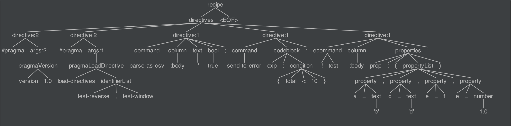

# Directive Grammar

This page provides more information on the constructs and grammar of dataprep.

## Recipe

```
#pragma version 1.0
#pragma load-directives test-reverse,test-window
parse-as-csv :body ',' true;
send-to-error exp:{ total < 10};
!test :body prop:{ a='b', c='d', e=f, e=1.0};
```

## AST


## Building in IDE
Intellij 
  * Install Plugin - Antlr v4 grammar plugin - version  1.8.4 or higher.
Configure Antlr Plugin
  * Output Directory : `${base}/wrangler/wrangler-core/target/generated-sources/antlr4`
  * Package : `io.cdap.wrangler.parser`
  * Auto generate upon save - ON
  * Generate Parse Tree Visitor - ON
  * Generate Parse Tree Listener - OFF
